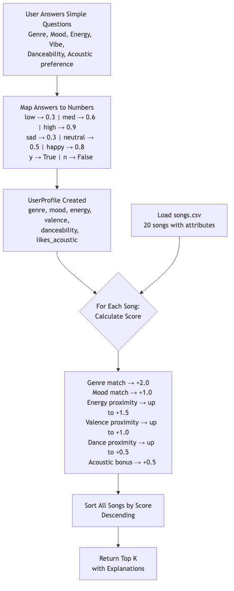
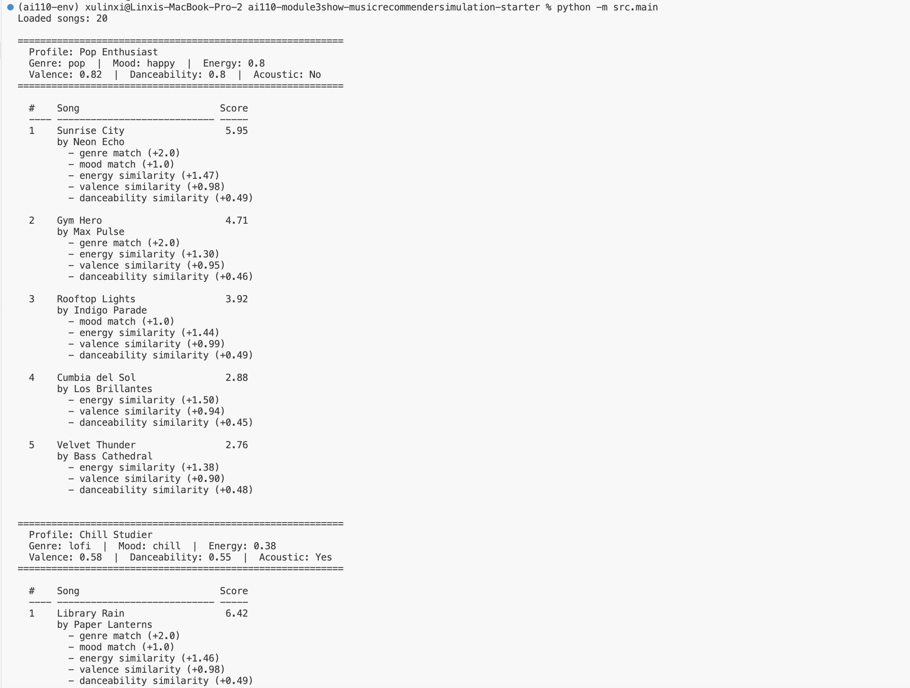
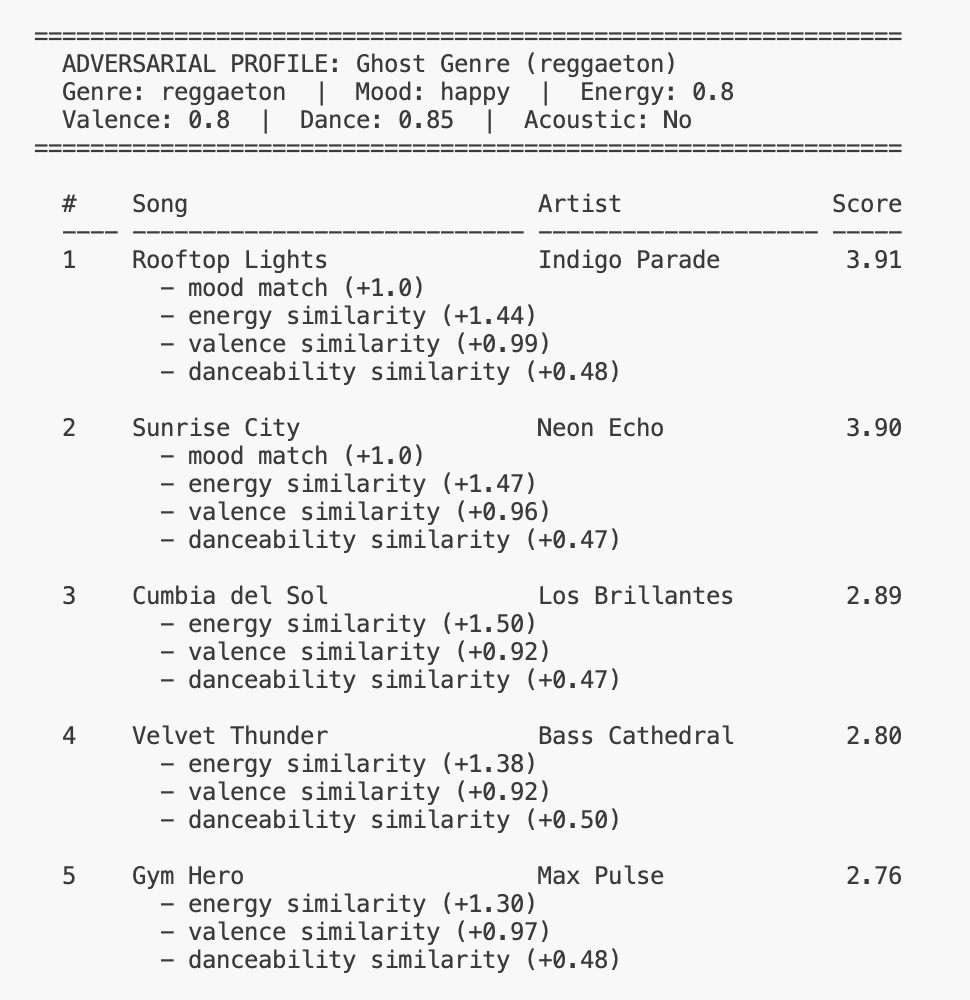
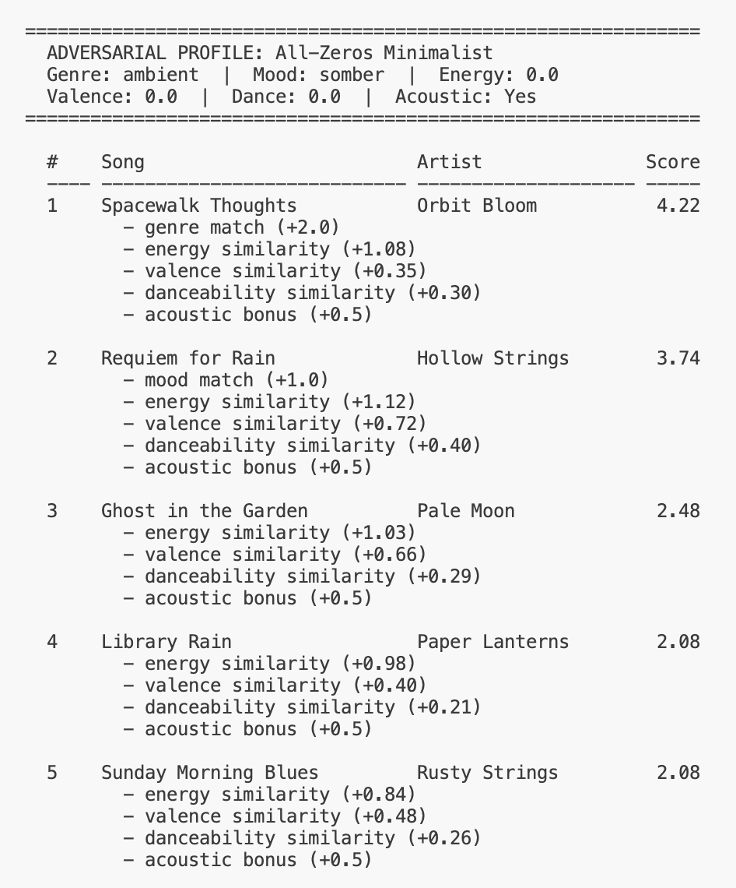
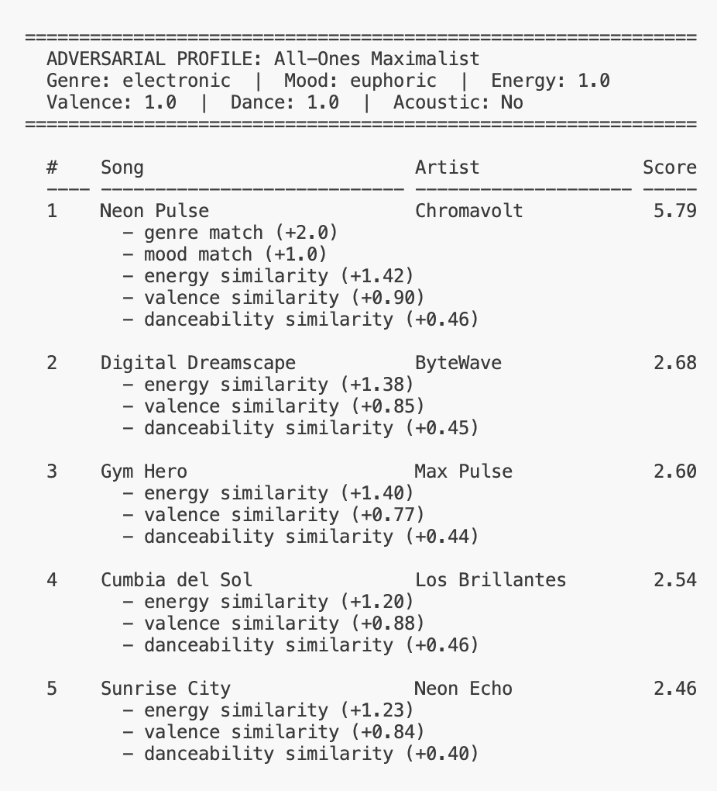
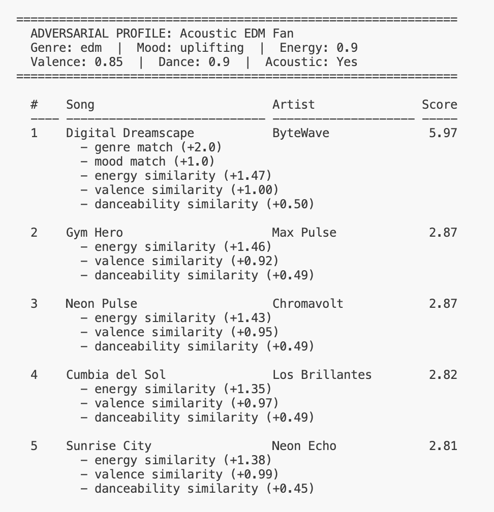
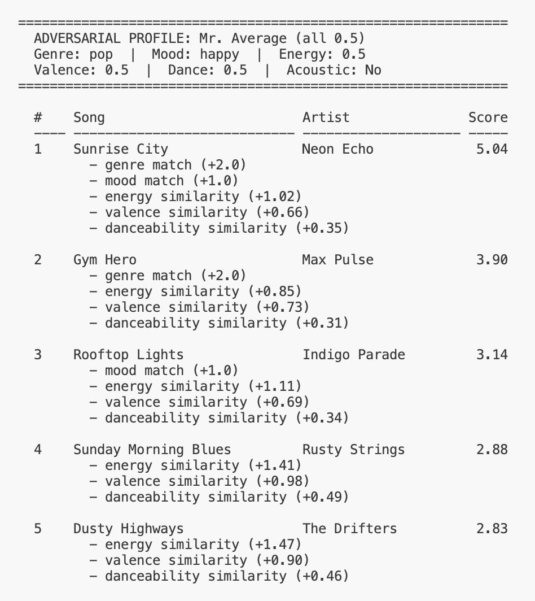
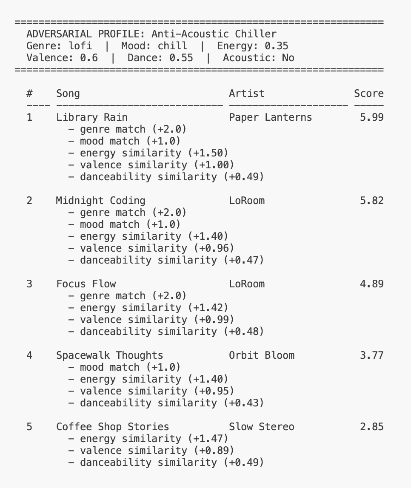
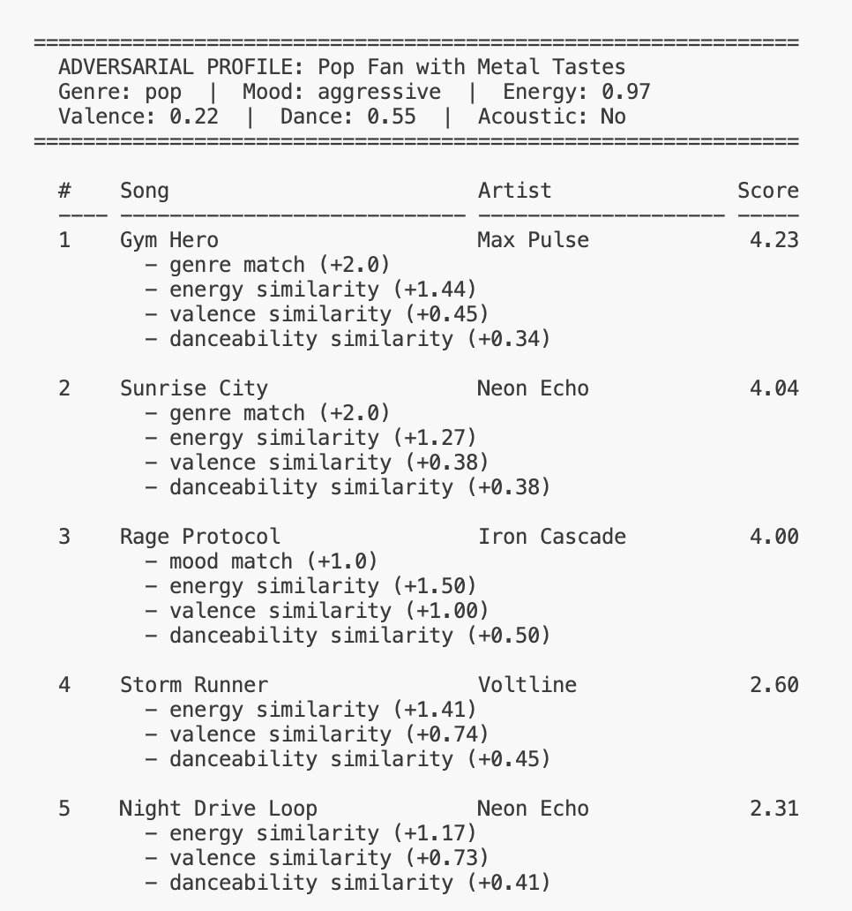

# 🎵 Music Recommender Simulation

## Project Summary

In this project you will build and explain a small music recommender system.

Your goal is to:

- Represent songs and a user "taste profile" as data
- Design a scoring rule that turns that data into recommendations
- Evaluate what your system gets right and wrong
- Reflect on how this mirrors real world AI recommenders

Replace this paragraph with your own summary of what your version does.

---

## How The System Works

### How Real-World Recommenders Work

Platforms like Spotify and YouTube combine two core strategies. **Collaborative filtering** finds patterns across millions of users — if you and another listener share 80% of the same favorites, songs they love that you haven't heard become candidates for you. **Content-based filtering** analyzes the attributes of the music itself (tempo, energy, mood, acousticness) and matches songs whose features are closest to your taste profile. Real systems blend both approaches in hybrid models, layered with contextual signals like time of day, device type, and listening session history, to rank thousands of candidates into a personalized list. Our simulation focuses on content-based filtering: scoring each song by how closely its attributes match a user's stated preferences.

### What Our Version Prioritizes

This recommender uses a **weighted similarity scoring** approach. For each song, it computes how close the song's features are to the user's preferences, then ranks all songs by that score and returns the top results.

### Song Features

Each `Song` object carries 10 attributes. Some are visible to the user, others drive the recommendation engine behind the scenes:

- **Visible to users:** `title`, `artist`, `genre`
- **Used for scoring (hidden from users):** `mood`, `energy`, `tempo_bpm`, `valence`, `danceability`, `acousticness`
- **Identifier:** `id`

### UserProfile Data

Each `UserProfile` stores the user's taste preferences:

- `favorite_genre` — preferred genre (e.g., "lofi", "pop")
- `favorite_mood` — preferred mood (e.g., "chill", "intense")
- `target_energy` — preferred energy level (0.0–1.0)
- `target_valence` — preferred emotional tone (0.0–1.0)
- `target_danceability` — preferred danceability (0.0–1.0)
- `likes_acoustic` — whether the user prefers acoustic-sounding tracks (boolean)

### How Users Provide Preferences

Users never enter raw numbers. The CLI asks plain-language questions and maps answers to numerical values behind the scenes:

| Question | Options | Mapped Value |
|---|---|---|
| Pick a genre | lofi, pop, rock, jazz, ... | stored as-is |
| Pick a mood | chill, happy, intense, focused, ... | stored as-is |
| Energy level? | low / medium / high | 0.3 / 0.6 / 0.9 |
| Vibe? | sad / neutral / happy | 0.3 / 0.5 / 0.8 |
| Danceability? | low / medium / high | 0.3 / 0.6 / 0.9 |
| Prefer acoustic? | y / n | True / False |

In a real-world system, these numbers would be computed implicitly by averaging the attributes of songs the user has listened to and liked.

### Scoring Rule (one song)

For each song, the recommender computes a point-based score by checking six factors:

| Factor | Points | How It's Scored |
|---|---|---|
| Genre match | +2.0 | Awarded if `song.genre == user.favorite_genre` |
| Mood match | +1.0 | Awarded if `song.mood == user.favorite_mood` |
| Energy similarity | up to +1.5 | `1.5 × (1 - abs(song.energy - user.target_energy))` |
| Valence similarity | up to +1.0 | `1.0 × (1 - abs(song.valence - user.target_valence))` |
| Danceability similarity | up to +0.5 | `0.5 × (1 - abs(song.danceability - user.target_danceability))` |
| Acousticness bonus | +0.5 | Awarded if `user.likes_acoustic` and `song.acousticness > 0.7` |

**Maximum possible score: ~6.5 points.**

**Why this weighting?**
- **Genre (+2.0)** is the strongest signal — it defines the broadest boundary of taste.
- **Mood (+1.0)** captures listener intent but is more context-dependent.
- **Energy (+1.5)** gets the highest continuous weight because the energy range in our catalog (0.25–0.97) represents the biggest perceptual difference between songs.
- **Valence (+1.0)** keeps emotional tone meaningful but below genre.
- **Danceability (+0.5)** serves as a tiebreaker, not a primary driver.
- **Acousticness (+0.5)** is a modest binary bonus for users who prefer acoustic-sounding tracks.

Genre alone cannot dominate: a genre match (2.0) without energy/mood alignment still loses to a non-genre match with strong continuous scores (up to 4.5).

### Ranking Rule (all songs)

1. Score every song in the catalog using the rule above
2. Sort by score in descending order
3. Return the top `k` results (default k=5) with explanations

### Data Flow Diagram



See [data_flow.md](data_flow.md) for the full Mermaid flowchart script of the recommendation process.

### Algorithm Recipe (Finalized)

```
score = 0.0

if song.genre == user.favorite_genre:      score += 2.0
if song.mood  == user.favorite_mood:        score += 1.0

score += 1.5 × (1 - |song.energy       - user.target_energy|)
score += 1.0 × (1 - |song.valence      - user.target_valence|)
score += 0.5 × (1 - |song.danceability - user.target_danceability|)

if user.likes_acoustic and song.acousticness > 0.7:
    score += 0.5

return score   # max ≈ 6.5
```

Sort all songs by score descending → return top k (default 5) with explanations.

### Potential Biases and Limitations

- **Genre over-prioritization.** At +2.0, genre is the single largest factor. A song that perfectly matches the user's mood, energy, and valence but belongs to a different genre will likely rank below a mediocre genre match. This can create a "genre bubble" where users never discover cross-genre songs they would enjoy.
- **Exact-string matching for genre and mood.** "indie pop" and "pop" are treated as completely different genres (0 points), even though they overlap significantly. Similarly, "chill" and "relaxed" earn no partial credit despite being nearly synonymous.
- **Small catalog bias.** With only 20 songs spanning 12 genres, some genres have just one representative. A user who picks "blues" will always get the same single song ranked highest, giving an illusion of confidence with no real variety.
- **No diversity mechanism.** The system ranks purely by score, so the top 5 could all be from the same artist or genre. Real recommenders inject diversity to avoid repetitive recommendations.
- **Static preferences.** The system assumes a user's taste is fixed for the session. It cannot adapt if the user skips a recommendation or changes mood mid-session.
- **Acousticness as a binary gate.** The 0.7 threshold is arbitrary — a song with 0.69 acousticness gets no bonus while 0.71 gets the full +0.5, creating a cliff effect rather than a smooth gradient.

---

## Getting Started

### Setup

1. Create a virtual environment (optional but recommended):

   ```bash
   python -m venv .venv
   source .venv/bin/activate      # Mac or Linux
   .venv\Scripts\activate         # Windows

2. Install dependencies

```bash
pip install -r requirements.txt
```

3. Run the app:

```bash
python -m src.main
```

### Running Tests

Run the starter tests with:

```bash
pytest
```

You can add more tests in `tests/test_recommender.py`.

---

## Experiments You Tried

Use this section to document the experiments you ran. For example:

- What happened when you changed the weight on genre from 2.0 to 0.5
- What happened when you added tempo or valence to the score
- How did your system behave for different types of users

### Sample Output

Below is a screenshot of the recommender running against four user profiles (Pop Enthusiast, Chill Studier, Workout Warrior, Melancholic Folkster), showing ranked song titles, scores, and the scoring reasons for each recommendation:



### Does It "Feel" Right? — Mr. Average (all 0.5) Intuition Check

Looking at the Edge Case 5 profile (genre: pop, mood: happy, energy: 0.5, valence: 0.5, danceability: 0.5), the results feel reasonable. "Sunrise City" (pop, happy) ranks first at 5.04, and the overall top-5 trend leans positive and upbeat, which matches what you'd expect from someone who picked "pop" and "happy."

**Why "Sunrise City" ranks #1 for this profile:** It is the only song in the catalog that matches *both* genre (pop, +2.0) and mood (happy, +1.0), giving it a 3.0-point head start before numeric features are even calculated. Its energy (0.82), valence (0.84), and danceability (0.79) each contribute moderate similarity scores against the 0.5 targets, adding another ~2.0 points. That combination of dual categorical match plus decent numeric similarity pushes it to 5.04 — comfortably ahead of #2 "Gym Hero" (3.90), which matches genre but not mood.

**Does "Sunrise City" always dominate?** No. It only appears at the top when the user's genre is "pop" *and* mood is "happy." For profiles like Workout Warrior (edm/energetic), Chill Studier (lofi/chill), or Anti-Acoustic Chiller (lofi/chill), "Sunrise City" doesn't even make the top 5. This confirms that the genre weight (+2.0) is working as intended — it's a strong signal but not an unfair one, since it requires alignment on genre to activate. The system provides variety across different profiles rather than funneling everyone toward the same song.

---

## Adversarial / Edge-Case Profile Analysis

To stress-test the scoring logic, we designed 7 adversarial user profiles with conflicting, extreme, or unusual preferences. Each profile targets a specific weakness in the recommendation algorithm.

### Edge Case 1: Ghost Genre (reggaeton)

**Profile:** Genre: reggaeton | Mood: happy | Energy: 0.8 | Valence: 0.8 | Dance: 0.85 | Acoustic: No



**Why it's adversarial:** "reggaeton" does not exist in the song catalog, so the +2.0 genre bonus never fires.

**What happened:** The top score is only 3.91 (vs. ~5-6 for profiles with matching genres). The system falls back entirely on mood match and numeric similarity. "Rooftop Lights" and "Sunrise City" tie near 3.9 thanks to their "happy" mood (+1.0) and close numeric features. Without genre, the recommendations are reasonable but the score ceiling drops significantly. **This reveals that non-existent genres degrade silently** — the user gets no warning that their genre preference was ignored entirely.

---

### Edge Case 2: All-Zeros Minimalist

**Profile:** Genre: ambient | Mood: somber | Energy: 0.0 | Valence: 0.0 | Dance: 0.0 | Acoustic: Yes



**Why it's adversarial:** All numeric features pushed to the absolute floor (0.0). No song in the catalog has values this extreme.

**What happened:** "Spacewalk Thoughts" (ambient, energy 0.28) wins at 4.22 with genre match + acoustic bonus. "Requiem for Rain" (somber, energy 0.25) is second at 3.74 with mood match + acoustic bonus. The system handles extremes gracefully here because the continuous scoring formula `1 - abs(diff)` degrades smoothly. However, **the acoustic bonus (+0.5) appears on all 5 results**, showing it acts as a blanket boost for any high-acousticness song rather than a targeted preference signal.

---

### Edge Case 3: All-Ones Maximalist

**Profile:** Genre: electronic | Mood: euphoric | Energy: 1.0 | Valence: 1.0 | Dance: 1.0 | Acoustic: No



**Why it's adversarial:** All numeric features maxed to 1.0. Tests the upper extreme.

**What happened:** "Neon Pulse" dominates at 5.79 with genre + mood match and the closest numeric features (energy 0.95, valence 0.90, danceability 0.92). The gap to #2 ("Digital Dreamscape" at 2.68) is massive — 3.11 points. **This shows how genre+mood together create a near-insurmountable advantage.** Even "Digital Dreamscape" (EDM, energy 0.92) with excellent numeric alignment can't compete without genre/mood bonuses.

---

### Edge Case 4: Acoustic EDM Fan

**Profile:** Genre: edm | Mood: uplifting | Energy: 0.9 | Valence: 0.85 | Dance: 0.9 | Acoustic: Yes



**Why it's adversarial:** The user says they like acoustic music but their favorite genre (EDM) is inherently non-acoustic (acousticness ~0.04). This creates a direct contradiction.

**What happened:** "Digital Dreamscape" (EDM, acousticness 0.04) wins at 5.97. The acoustic bonus **never fires for any of the top 5** because all high-energy/danceable songs have low acousticness. The `likes_acoustic: True` preference is completely invisible in the results. **This is the biggest scoring flaw: the acoustic feature is asymmetric.** It can only add +0.5 (never penalize), so when the user's genre preferences conflict with their acoustic preference, the acoustic preference silently disappears.

---

### Edge Case 5: Mr. Average (all 0.5)

**Profile:** Genre: pop | Mood: happy | Energy: 0.5 | Valence: 0.5 | Dance: 0.5 | Acoustic: No



**Why it's adversarial:** All numeric features at the dead center (0.5). Tests whether the system has a "bland middle" bias where many songs cluster near similar scores.

**What happened:** "Sunrise City" (pop, happy) wins at 5.04 with both genre and mood match. Interestingly, #4 "Sunday Morning Blues" (blues, energy 0.44) and #5 "Dusty Highways" (country, energy 0.48) score 2.88 and 2.83 — nearly identical despite being completely different genres and moods. **The mid-range profile creates a cluster of mediocre matches** where the system struggles to differentiate. Songs with no genre/mood match all land in a narrow 2.5-2.9 band, making the ranking feel arbitrary for everything below the genre-matched songs.

---

### Edge Case 6: Anti-Acoustic Chiller

**Profile:** Genre: lofi | Mood: chill | Energy: 0.35 | Valence: 0.6 | Dance: 0.55 | Acoustic: No



**Why it's adversarial:** The user explicitly does NOT want acoustic music (`likes_acoustic: False`), but lofi songs in the catalog have very high acousticness (0.71-0.86).

**What happened:** "Library Rain" (acousticness 0.86) wins at 5.99. "Midnight Coding" (acousticness 0.71) is second at 5.82. All top 3 are highly acoustic songs. **Setting `likes_acoustic: False` has absolutely zero effect on the results** — there is no penalty mechanism for acoustic songs. The scoring is entirely one-sided: acoustic preference can only help, never hurt. A user who actively dislikes acoustic music gets a wall of acoustic recommendations. This confirms the asymmetry found in Edge Case 4 from the opposite direction.

---

### Edge Case 7: Pop Fan with Metal Tastes

**Profile:** Genre: pop | Mood: aggressive | Energy: 0.97 | Valence: 0.22 | Dance: 0.55 | Acoustic: No



**Why it's adversarial:** The user says their genre is "pop" but all their numeric preferences (very high energy, very low valence, aggressive mood) perfectly describe metal music. Tests whether genre label or actual taste features drive the recommendation.

**What happened:** "Gym Hero" (pop, energy 0.93) wins at 4.23 thanks to the +2.0 genre bonus, despite only moderate numeric alignment (valence 0.77 vs. target 0.22 is a poor match). "Rage Protocol" (metal, aggressive) is #3 at 4.00 with a perfect numeric match (+1.50 energy, +1.00 valence, +0.50 danceability) plus mood match (+1.0). **The genre bonus of +2.0 lets a numerically poor match ("Sunrise City" at 4.04) outrank a numerically perfect match ("Rage Protocol" at 4.00).** This demonstrates that genre is over-weighted: it can override near-perfect alignment on every other feature.

---

### Summary of Vulnerabilities Found

| # | Edge Case | Key Finding |
|---|---|---|
| 1 | Ghost Genre | Non-existent genres silently degrade; no user feedback |
| 2 | All-Zeros | Acoustic bonus is a blanket boost, not targeted |
| 3 | All-Ones | Genre+mood create an insurmountable 3+ point gap |
| 4 | Acoustic EDM | `likes_acoustic` is invisible when genre conflicts with acousticness |
| 5 | Mr. Average | Mid-range profiles create indistinguishable score clusters |
| 6 | Anti-Acoustic | `likes_acoustic: False` has zero effect — no penalty exists |
| 7 | Pop + Metal Tastes | Genre bonus overrides perfect numeric alignment |

---

## Optional Extensions

### Challenge 1: Advanced Song Features

We added 5 new attributes to every song in `data/songs.csv` that were not in the original 10-song starter:

| Feature | Type | What It Captures |
|---|---|---|
| `popularity` | 0–100 | How well-known the song is |
| `release_decade` | string | Era of the song (e.g. "2020s", "1990s") |
| `mood_tags` | semicolon-separated list | Detailed emotional descriptors (e.g. "nostalgic;dreamy") |
| `instrumental` | 0.0–1.0 | How instrumental vs. vocal the track is |
| `lyrics_sentiment` | 0.0–1.0 | Positivity of lyrics (0 = dark/none, 1 = positive) |

**How each feature is scored:**

- **Popularity:** Normalized from 0–100 to 0.0–1.0, then multiplied by its weight. A song with popularity 85 at weight 0.5 earns `0.5 × (85/100) = 0.425`. This is a flat bonus — the system simply favors popular songs rather than matching a target.
- **Decade:** Exact match, like genre. If the user sets `preferred_decade: "2020s"` and the song matches, it gets the full weight. No partial credit for adjacent decades.
- **Mood tags:** Uses **set intersection for partial credit**. If the user wants `["nostalgic", "dreamy"]` and a song has `["nostalgic", "warm"]`, the overlap is 1 out of 2 tags, so it earns `weight × (1/2) = half credit`. This solves the all-or-nothing problem that genre and mood matching had.
- **Instrumental:** Uses the same `1 - abs(diff)` similarity formula as energy/valence. A user targeting 0.85 instrumentalness and a song at 0.90 earns `weight × (1 - 0.05) = 95%` of the max.
- **Lyrics sentiment:** Same similarity formula. A user wanting dark lyrics (target 0.10) closely matches a song with sentiment 0.00.

All 5 features are **gated by weight** — they only activate when their weight is non-zero. The default `"balanced"` mode sets them all to 0.0, preserving original behavior. Only `"full-feature"` mode turns them on.

---

### Challenge 2: Multiple Scoring Modes (Strategy Pattern)

Instead of one fixed set of weights, the recommender now supports **5 named scoring strategies**. The algorithm stays the same — only the weight configuration changes. This is the Strategy Pattern.

| Mode | Key Weights | When to Use |
|---|---|---|
| `balanced` | genre 2.0, mood 1.0, energy 1.5 | Default — original baseline |
| `genre-first` | genre **4.0**, everything else ≤ 0.5 | When genre loyalty matters most |
| `mood-first` | mood **3.0**, mood_tags 1.0, valence 1.5 | When emotional fit matters most |
| `energy-focused` | energy **3.0**, dance **1.5**, genre 0.5 | Workouts, parties, physical context |
| `full-feature` | All 11 features active | Uses the 5 new Challenge 1 attributes |

**How it works in code:** `SCORING_MODES` is a dictionary of dictionaries. Each key is a mode name, each value is a complete weight set. The `score_song()` function accepts an optional `mode` parameter — if provided, it looks up the weights by name; otherwise it falls back to the legacy Choice 0/1/2 system.

**How to switch modes:** Pass the mode name to `recommend_songs()`:
```python
recommend_songs(user_prefs, songs, k=5, mode="mood-first")
```

---

### Challenge 3: Diversity and Fairness Logic

The diversity penalty prevents the top results from being dominated by the same artist or genre.

**How it works:** After initial scoring, `apply_diversity_penalty()` walks through songs in score order and maintains two counters — `seen_artists` and `seen_genres`. If a song's artist or genre already appeared, its score is reduced:

- **Repeat artist:** `-1.0 × number of times already seen`
- **Repeat genre:** `-0.5 × number of times already seen`

The penalty **escalates** with each repeat. The 2nd LoRoom song gets -1.0 (artist) and -0.5 (genre). A hypothetical 3rd would get -2.0 and -1.0. This naturally pushes diverse songs upward.

**Example — Chill Studier profile:**

| Rank | Without Diversity | With Diversity |
|---|---|---|
| 1 | Library Rain (lofi, Paper Lanterns) 6.88 | Library Rain (lofi, Paper Lanterns) 6.88 |
| 2 | Midnight Coding (lofi, LoRoom) 6.83 | Midnight Coding (lofi, LoRoom) 6.33 — *repeat genre -0.5* |
| 3 | Focus Flow (lofi, LoRoom) 5.90 | **Spacewalk Thoughts** (ambient, Orbit Bloom) 5.56 |
| 4 | Spacewalk Thoughts (ambient) 5.56 | Coffee Shop Stories (jazz, Slow Stereo) 4.83 |
| 5 | Coffee Shop Stories (jazz) 4.83 | Sunday Morning Blues (blues, Rusty Strings) 4.72 |

Focus Flow dropped from #3 to #4 because it got `-1.0` (repeat LoRoom) and `-0.5` (repeat lofi), letting a different genre and artist surface at #3.

**How to enable:** Pass `diversity=True` to `recommend_songs()`:
```python
recommend_songs(user_prefs, songs, k=5, diversity=True)
```

---

### Challenge 4: Visual Summary Table

The terminal output now uses the `tabulate` library with `fancy_grid` formatting instead of manual f-string formatting.

**Before (manual formatting):**
```
  #    Song                         Score
  ---- ---------------------------- -----
  1    Sunrise City                  5.95
       by Neon Echo
         - genre match (+2.0)
```

**After (tabulate):**
```
╒═════╤════════════════╤═════════╤═════════════════════════════════════╕
│  #  │ Song           │   Score │ Reasons                             │
╞═════╪════════════════╪═════════╪═════════════════════════════════════╡
│  1  │ Sunrise City   │    6.42 │ - genre match (+1.0)                │
│     │                │         │   - energy similarity (+2.94)       │
╘═════╧════════════════╧═════════╧═════════════════════════════════════╛
```

**How it works:** The `format_results_table()` function takes the recommendation list and builds a table with 5 columns: rank, song title, artist, score, and reasons. The key detail is that the semicolon-separated explanation string is split into bullet-pointed lines (`"\n".join(f"  - {r}" for ...)`) so each scoring reason gets its own row inside the cell. Tabulate auto-calculates column widths based on content, so it adapts to any song title length — unlike the old fixed-width formatting which broke on long names.

**Usage:**
```python
from src.recommender import format_results_table
print(format_results_table(recommendations, "Profile Name", user_prefs))
```

---

## Possible Next Step: Enhancing with Machine Learning

Our current recommender is purely rule-based — we hand-picked every weight and formula. Machine learning could replace those manual decisions with data-driven ones. Below are concrete ways ML libraries could enhance this project.

### 1. Learn Optimal Weights with scikit-learn (Regression)

**The problem:** We manually set genre to 2.0, energy to 1.5, etc. These weights are guesses. Are they actually optimal?

**The ML approach:** If we collected user feedback (e.g., "did the user like this recommendation? yes/no"), we could train a regression model to learn the best weights automatically.

```
Library: scikit-learn
Model: LinearRegression or Ridge
Input features (X): genre_match (0/1), mood_match (0/1), energy_diff, valence_diff, danceability_diff, acousticness
Target (y): user satisfaction score (1-5 rating or binary like/skip)
Output: learned coefficients = optimal weights
```

The learned coefficients would directly replace our hand-tuned weights. If the model learns `genre_coef = 0.8` and `energy_coef = 2.3`, that tells us energy matters more than genre — something our adversarial testing already hinted at.

### 2. Semantic Genre/Mood Similarity with Sentence Embeddings

**The problem:** Our system treats "indie pop" and "pop" as completely unrelated (0 points). Same for "chill" vs. "relaxed."

**The ML approach:** Use a pre-trained embedding model to convert genre and mood strings into vectors, then compute cosine similarity instead of exact matching.

```
Library: sentence-transformers (or scikit-learn with pre-computed embeddings)
Model: all-MiniLM-L6-v2 (lightweight, fast)
How: embed("indie pop") and embed("pop") → cosine similarity ≈ 0.85 → partial credit
```

This would replace the binary genre/mood check with a smooth 0.0–1.0 similarity score, eliminating the all-or-nothing cliff and making the system aware that related genres should get partial credit.

### 3. K-Nearest Neighbors for Content-Based Filtering

**The problem:** Our scoring function computes similarity one feature at a time with separate weights. It can't capture feature *interactions* (e.g., high energy + low valence together = "intense" but neither alone implies it).

**The ML approach:** Represent each song as a feature vector and use KNN to find the most similar songs to a user's ideal profile in one step.

```
Library: scikit-learn
Model: NearestNeighbors (with cosine or euclidean distance)
Input: song feature vectors [energy, valence, danceability, acousticness, instrumental, ...]
Query: user preference vector [target_energy, target_valence, ...]
Output: k nearest songs by distance
```

KNN considers all features simultaneously and naturally handles feature interactions. A song that's close in the combined feature space ranks higher, even if no single feature is a perfect match.

### 4. Clustering Songs for Discovery with K-Means

**The problem:** The diversity penalty is a post-hoc fix. The system doesn't understand that songs naturally group into "vibes."

**The ML approach:** Cluster songs into groups based on their audio features, then ensure recommendations pull from multiple clusters.

```
Library: scikit-learn
Model: KMeans (n_clusters=5-7)
Input: [energy, valence, danceability, acousticness, tempo_bpm, instrumental]
Output: cluster labels — e.g., "high-energy dance," "quiet acoustic," "dark intense"
```

Instead of the current genre-label-based diversity penalty, we could enforce diversity across learned clusters. A "quiet acoustic" cluster might contain songs from lofi, folk, jazz, and classical — genres that sound similar despite different labels.

### 5. Collaborative Filtering with Surprise

**The problem:** Our system is purely content-based — it only looks at song features. It can't learn from what *other* users liked.

**The ML approach:** If we had a user-song interaction matrix (users rating or playing songs), we could use matrix factorization to discover latent taste dimensions.

```
Library: surprise (scikit-surprise)
Model: SVD (Singular Value Decomposition)
Input: user-song rating matrix (user_id, song_id, rating)
Output: predicted ratings for songs a user hasn't heard
```

This is what Spotify does at scale. Users who share 80% of the same favorites likely share the remaining 20% too. The model discovers these patterns without needing to know *why* the songs are similar.

### 6. Claude API for Natural Language Preferences

**The problem:** Users currently pick from fixed menus (genre, mood, energy level). Real preferences are more nuanced — "I want something like what I'd hear at a late-night coffee shop in Tokyo."

**The ML approach:** Use the Claude API to interpret free-text descriptions and map them to feature vectors.

```
Library: anthropic (Claude API SDK)
How: Send the user's natural language description to Claude along with the song catalog,
     and ask it to return a ranked list with explanations.
```

This would let users describe what they want in plain English instead of filling out a form, making the system feel more like talking to a knowledgeable friend.

### Summary: Which ML Approach Solves Which Problem

| Current Limitation | ML Solution | Library |
|---|---|---|
| Hand-tuned weights | Learn weights from feedback data | scikit-learn (Ridge) |
| Exact-string genre/mood matching | Embedding-based semantic similarity | sentence-transformers |
| Independent feature scoring | Multi-dimensional similarity | scikit-learn (KNN) |
| Post-hoc diversity penalty | Cluster-based diversity | scikit-learn (KMeans) |
| No cross-user learning | Collaborative filtering | surprise (SVD) |
| Fixed-menu preferences | Natural language understanding | anthropic (Claude API) |

These enhancements are additive — each one can be implemented independently without rewriting the rest of the system. The simplest starting point would be **#1 (learn weights)** since it plugs directly into our existing scoring function, and **#2 (semantic similarity)** since it fixes the most obvious flaw we found in adversarial testing.

---

## Limitations and Risks

Summarize some limitations of your recommender.

Examples:

- It only works on a tiny catalog
- It does not understand lyrics or language
- It might over favor one genre or mood

You will go deeper on this in your model card.

---

## Reflection

Read and complete `model_card.md`:

[**Model Card**](model_card.md)

Write 1 to 2 paragraphs here about what you learned:

- about how recommenders turn data into predictions
- about where bias or unfairness could show up in systems like this


---

## 7. `model_card_template.md`

Combines reflection and model card framing from the Module 3 guidance. :contentReference[oaicite:2]{index=2}  

```markdown
# 🎧 Model Card - Music Recommender Simulation

## 1. Model Name

Give your recommender a name, for example:

> VibeFinder 1.0

---

## 2. Intended Use

- What is this system trying to do
- Who is it for

Example:

> This model suggests 3 to 5 songs from a small catalog based on a user's preferred genre, mood, and energy level. It is for classroom exploration only, not for real users.

---

## 3. How It Works (Short Explanation)

Describe your scoring logic in plain language.

- What features of each song does it consider
- What information about the user does it use
- How does it turn those into a number

Try to avoid code in this section, treat it like an explanation to a non programmer.

---

## 4. Data

Describe your dataset.

- How many songs are in `data/songs.csv`
- Did you add or remove any songs
- What kinds of genres or moods are represented
- Whose taste does this data mostly reflect

---

## 5. Strengths

Where does your recommender work well

You can think about:
- Situations where the top results "felt right"
- Particular user profiles it served well
- Simplicity or transparency benefits

---

## 6. Limitations and Bias

Where does your recommender struggle

Some prompts:
- Does it ignore some genres or moods
- Does it treat all users as if they have the same taste shape
- Is it biased toward high energy or one genre by default
- How could this be unfair if used in a real product

---

## 7. Evaluation

How did you check your system

Examples:
- You tried multiple user profiles and wrote down whether the results matched your expectations
- You compared your simulation to what a real app like Spotify or YouTube tends to recommend
- You wrote tests for your scoring logic

You do not need a numeric metric, but if you used one, explain what it measures.

---

## 8. Future Work

If you had more time, how would you improve this recommender

Examples:

- Add support for multiple users and "group vibe" recommendations
- Balance diversity of songs instead of always picking the closest match
- Use more features, like tempo ranges or lyric themes

---

## 9. Personal Reflection

A few sentences about what you learned:

- What surprised you about how your system behaved
- How did building this change how you think about real music recommenders
- Where do you think human judgment still matters, even if the model seems "smart"

