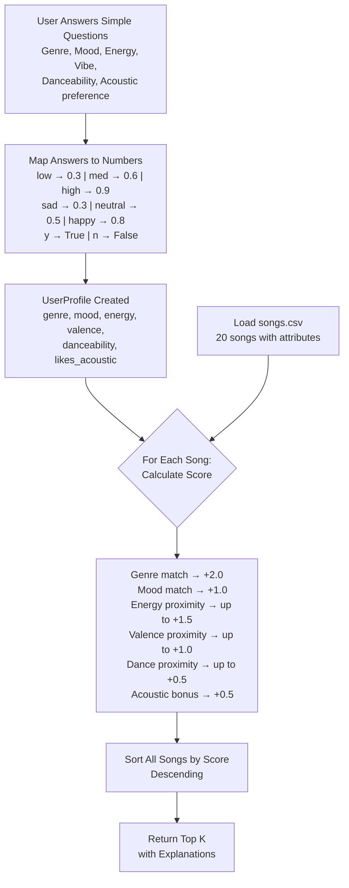

# Data Flow Diagram

```mermaid
flowchart TD
    A["User Answers Simple Questions
    Genre, Mood, Energy, Vibe,
    Danceability, Acoustic preference"]

    B["Map Answers to Numbers
    low → 0.3 | med → 0.6 | high → 0.9
    sad → 0.3 | neutral → 0.5 | happy → 0.8
    y → True | n → False"]

    C["UserProfile Created
    genre, mood, energy, valence,
    danceability, likes_acoustic"]

    D["Load songs.csv
    20 songs with attributes"]

    E{"For Each Song:
    Calculate Score"}

    F["Genre match → +2.0
    Mood match → +1.0
    Energy proximity → up to +1.5
    Valence proximity → up to +1.0
    Dance proximity → up to +0.5
    Acoustic bonus → +0.5"]

    G["Sort All Songs by Score
    Descending"]

    H["Return Top K
    with Explanations"]

    A --> B --> C --> E
    D --> E
    E --> F --> G --> H
```
